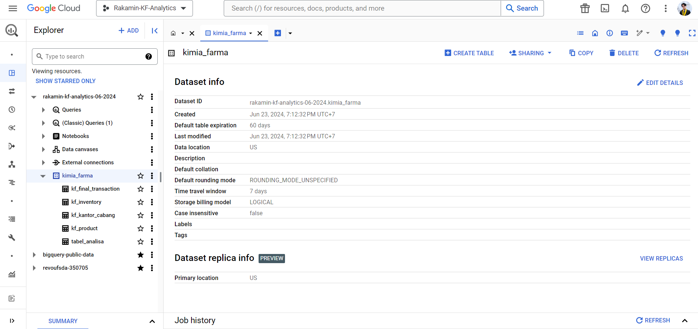
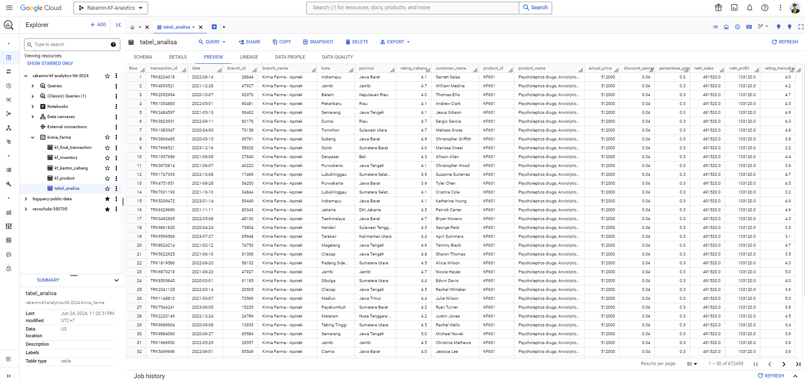
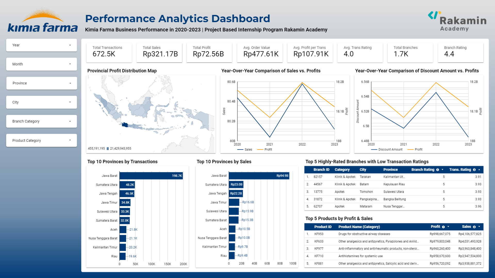

# Kimia Farma Big Data Analytics Project Based Internship Program - June 2024
by Syarif Romadhon

Tools : |💻 Google BigQuery |📊 Google Looker Studio

## Project Description
As a Big Data Analytics Intern at Kimia Farma, you'll be tasked with evaluating the company's business performance from 2020 to 2023. This project will require a deep understanding of data and strong analytical skills. Here's a breakdown of the key tasks involved:
1. Importing Dataset to BigQuery
2. Create “tabel analisa”
3. Create Dashboard Performance Analytics Kimia Farma Business Year 2020-2023

### 1. Importing Dataset to BigQuery
Import the four datasets to become a table in BigQuery, the table name is the name of the dataset, but without ".csv"
- kf_final_transaction.csv ([link](https://drive.google.com/file/d/1iDOBdKZ4-kkLhpklQWWrsFvACtI7MCz3/view?usp=sharing))
  - transaction_id: kode id transaksi
  - product_id : kode produk obat
  - branch_id: kode id cabang Kimia Farma
  - customer_name: nama customer yang melakukan transaksi
  - date: tanggal transaksi dilakukan
  - price: harga obat
  - discount_percentage: Persentase diskon yang diberikan pada obat
  - rating: penilaian konsumen terhadap transaksi yang dilakukan
- kf_inventory.csv ([link](https://drive.google.com/file/d/1ihtG2t0V1AO0IAGkGwQaqtba6AxDEKDI/view?usp=sharing))
  - inventory_id: kode inventory produk obat
  - branch_id: kode id cabang Kimia Farma
  - product_id: kode id produk obat
  - product_name: nama produk obat
  - opname_stock: jumlah stok produk obat
- kf_kantor_cabang.csv ([link](https://drive.google.com/file/d/1vzaasqIeXqqe_jI99dNLaa8nxnoe9OWW/view?usp=sharing))
  - branch_id: kode id cabang Kimia Farma
  - branch_category: kategori cabang Kimia Farma
  - branch_name: nama kantor cabang Kimia Farma
  - kota: kota cabang Kimia Farma
  - provinsi: provinsi cabang Kimia Farma
  - rating: penilaian konsumen terhadap cabang Kimia Farma
- kf_product.csv ([link](https://drive.google.com/file/d/1739wO7BwtVStHCA4Dcj9xGhlc_blBNbT/view?usp=sharing))
  - product_id: kode produk obat
  - product_name: nama produk obat
  - product_category: kategori produk obat
  - price: harga obat

### 2. Create “Tabel Analisa”
Create an analysis table based on the aggregated results of the four imported tables. The following are the mandatory columns in the table:
- transaction_id : kode id transaksi,
- date : tanggal transaksi dilakukan,
- branch_id : kode id cabang Kimia Farma,
- branch_name : nama cabang Kimia Farma,
- kota : kota cabang Kimia Farma,
- provinsi : provinsi cabang Kimia Farma,
- rating_cabang : penilaian konsumen terhadap cabang Kimia Farma
- customer_name : Nama customer yang melakukan transaksi,
- product_id : kode product obat,
- product_name : nama obat,
- actual_price : harga obat,
- discount_percentage : Persentase diskon yang diberikan pada obat,
- persentase_gross_laba : Persentase laba yang seharusnya diterima dari obat dengan ketentuan berikut:
  - Harga <= Rp 50.000 -> laba 10%
  - Harga > Rp 50.000 - 100.000 -> laba 15%
  - Harga > Rp 100.000 - 300.000 -> laba 20%
  - Harga > Rp 300.000 - 500.000 -> laba 25%
  - Harga > Rp 500.000 -> laba 30%,
- nett_sales : harga setelah diskon,
- nett_profit : keuntungan yang diperoleh Kimia Farma,
- rating_transaksi : penilaian konsumen terhadap transaksi yang dilakukan.

### 3. Create Dashboard Performance Analytics Kimia Farma Business Year 2020-2023
Create a performance analysis dashboard for Kimia Farma 2020-2023 in Google Looker Studio based on the “Tabel Analisa” that previously created in BigQuery. So we need to connect the table to Google Looker Studio. The dashboard content must include:
- Title Dashboard
- Dashboard Summary
- Filter Control
- Data Snapshot
- Year-on-year comparison of Kimia Farma's revenue
- Top 10 Total transactions of provincial branches
- Top 10 Nett sales of provincial branches
- Top 5 Branches with Highest Rating, but Lowest Rating Lowest Transaction Rating
- Indonesia's Geo Map for Total Profit of Each Province
- And other analysis that you can explore.

## Result
### 1. Import Data Tables

### 2. Create Tabel Analisa in BigQuery ([link](https://console.cloud.google.com/bigquery?sq=67725819441:49e812a80712472d925a227a90b7f9ca))

### 3. Kimia Farma Performance Analytics Dashboard ([link](https://lookerstudio.google.com/reporting/e3d7f563-0deb-4a37-aa85-a1d729b53c96))

